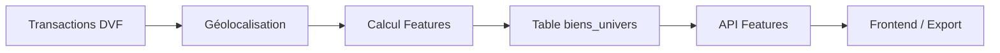

# 🤖 Features ML - ProspectScore Pro

Documentation complète de l'API Features ML pour le scoring de propension à vendre.

---

## 📊 Vue d'ensemble

### Qu'est-ce que les Features ML ?

Les **features ML** (Machine Learning features) sont des variables contextuelles calculées pour chaque bien immobilier afin d'estimer sa **propension à être vendu**.

### Features disponibles

| Feature | Description | Valeurs |
|---------|-------------|---------|
| `zone_type` | Classification géographique | RURAL_ISOLE / RURAL / PERIURBAIN / URBAIN |
| `local_turnover_12m` | Ventes dans un rayon de 500m sur 12 mois | Entier (0-∞) |
| `sale_density_12m` | Densité de ventes corrigée | Float (0-0.935) |
| `avg_local_price` | Prix moyen dans la zone | Float (€) |
| `median_local_price` | Prix médian dans la zone | Float (€) |
| `local_price_evolution` | Évolution prix sur 12 mois | Float (%) |
| `zone_attractivity_score` | Score d'attractivité | Float (0-100) |
| `propensity_score` | Score de propension à vendre | Integer (0-100) |
| `propensity_category` | Catégorie de propension | TRES_FORT / FORT / MOYEN / FAIBLE |

---

## 🚀 Installation

### 1. Créer la table biens_univers

```bash
cd /var/www/prospectscore-pro  # ou votre chemin
./scripts/setup_features_ml.sh
```

Ce script va :
- ✅ Créer la table `biens_univers`
- ✅ Créer les index spatiaux PostGIS
- ✅ Créer les fonctions helper
- ✅ Créer les vues de statistiques

### 2. Vérifier la création

```bash
docker exec -it postgres-prospectscore psql -U prospectscore -d prospectscore

-- Dans psql
\dt biens_univers
\d biens_univers
SELECT * FROM v_biens_univers_stats;
```

### 3. Redémarrer le backend

```bash
cd /var/www/prospectscore-pro
docker-compose restart backend
```

---

## 📡 API Endpoints

### 1. **Informations API**

```http
GET /api/features/
```

**Réponse** :
```json
{
  "name": "ProspectScore Pro - Features ML API",
  "version": "1.0.0",
  "features_disponibles": [...],
  "endpoints": {...}
}
```

---

### 2. **Features d'un bien spécifique**

```http
GET /api/features/{id_bien}
GET /api/prospects/{id_bien}/features  (alias)
```

**Exemple** :
```bash
curl http://localhost:8003/api/features/12345
```

**Réponse** :
```json
{
  "id_bien": 12345,
  "adresse": "12 RUE DE LA LIBERATION",
  "code_postal": "76260",
  "commune": "CRIEL-SUR-MER",
  "type_local": "Maison",
  "surface_reelle": 95.0,
  "nombre_pieces": 5,
  "last_price": 185000.0,
  "features": {
    "zone_type": "RURAL",
    "local_turnover_12m": 8,
    "sale_density_12m": 0.0234,
    "avg_local_price": 165000.0,
    "median_local_price": 158000.0,
    "local_price_evolution": 3.5,
    "zone_attractivity_score": 72.5
  },
  "propensity": {
    "score": 68,
    "category": "FORT"
  },
  "metadata": {
    "features_calculated": true,
    "features_calculated_at": "2025-11-07T14:30:00"
  }
}
```

---

### 3. **Recherche avancée par features**

```http
GET /api/features/search
```

**Paramètres** :
- `zone_type` : RURAL_ISOLE / RURAL / PERIURBAIN / URBAIN
- `code_postal` : Code postal (5 chiffres ou préfixe)
- `type_local` : Maison, Appartement, etc.
- `min_turnover` : Turnover local minimum
- `max_turnover` : Turnover local maximum
- `min_density` : Densité minimum (0-1)
- `max_density` : Densité maximum (0-1)
- `min_propensity` : Score propension minimum (0-100)
- `max_propensity` : Score propension maximum (0-100)
- `sort_by` : Champ de tri (défaut: `propensity_score`)
- `sort_order` : asc / desc (défaut: `desc`)
- `limit` : Nombre max de résultats (défaut: 50, max: 1000)
- `offset` : Offset pour pagination

**Exemples** :

```bash
# Biens ruraux isolés avec fort turnover
curl "http://localhost:8003/api/features/search?zone_type=RURAL_ISOLE&min_turnover=5"

# Biens en zone urbaine avec forte propension
curl "http://localhost:8003/api/features/search?zone_type=URBAIN&min_propensity=70"

# Maisons dans le 76 avec densité élevée
curl "http://localhost:8003/api/features/search?code_postal=76&type_local=Maison&min_density=0.1"

# Top 100 prospects par propension
curl "http://localhost:8003/api/features/search?sort_by=propensity_score&limit=100"
```

---

### 4. **Biens par zone type**

```http
GET /api/features/by-zone/{zone_type}
```

**Exemple** :
```bash
curl http://localhost:8003/api/features/by-zone/RURAL
```

**Zone types valides** :
- `RURAL_ISOLE` : < 3 ventes/an dans 500m
- `RURAL` : 3-9 ventes/an
- `PERIURBAIN` : 10-19 ventes/an
- `URBAIN` : ≥ 20 ventes/an

---

### 5. **Biens par code postal**

```http
GET /api/features/by-postal-code/{code_postal}
```

**Exemples** :
```bash
# Code postal complet
curl http://localhost:8003/api/features/by-postal-code/76260

# Préfixe (tous les codes 76xxx)
curl http://localhost:8003/api/features/by-postal-code/76
```

---

### 6. **Top propension**

```http
GET /api/features/top-propensity
```

Retourne les biens avec les scores de propension les plus élevés.

**Paramètres** :
- `zone_type` : Filtrer par zone (optionnel)
- `code_postal` : Filtrer par code postal (optionnel)
- `limit` : Nombre max (défaut: 100, max: 500)

**Exemples** :
```bash
# Top 50 prospects toutes zones
curl "http://localhost:8003/api/features/top-propensity?limit=50"

# Top 100 en zone rurale
curl "http://localhost:8003/api/features/top-propensity?zone_type=RURAL&limit=100"

# Top prospects dans le 76
curl "http://localhost:8003/api/features/top-propensity?code_postal=76&limit=200"
```

---

### 7. **Statistiques globales**

```http
GET /api/features/stats
```

**Réponse** :
```json
{
  "total_biens": 604622,
  "biens_avec_features": 302650,
  "pourcentage_features": 50.04,
  "repartition_zone_type": {
    "RURAL_ISOLE": 286855,
    "RURAL": 9127,
    "PERIURBAIN": 5524,
    "URBAIN": 1144
  },
  "repartition_propensity": {
    "TRES_FORT": 12560,
    "FORT": 45230,
    "MOYEN": 98470,
    "FAIBLE": 146390
  },
  "stats_turnover": {
    "avg": 2.34,
    "min": 0,
    "max": 87
  },
  "stats_density": {
    "avg": 0.0156,
    "min": 0.0,
    "max": 0.935
  }
}
```

---

## 🧪 Cas d'usage

### Cas 1 : Identifier les meilleures opportunités

```bash
# Top 100 biens avec forte propension
curl "http://localhost:8003/api/features/top-propensity?limit=100"
```

### Cas 2 : Cibler une zone spécifique

```bash
# Biens à forte propension dans Criel-sur-Mer
curl "http://localhost:8003/api/features/search?code_postal=76260&min_propensity=60"
```

### Cas 3 : Analyser le marché local

```bash
# Biens en zone urbaine avec forte activité
curl "http://localhost:8003/api/features/search?zone_type=URBAIN&min_turnover=15"
```

### Cas 4 : Exporter pour analyse

```bash
# Export CSV avec jq
curl "http://localhost:8003/api/features/search?limit=1000" | jq -r '
  ["id_bien","adresse","code_postal","zone_type","turnover","propensity_score"],
  (.[] | [.id_bien, .adresse, .code_postal, .features.zone_type, .features.local_turnover_12m, .propensity.score])
  | @csv'
```

---

## 🔧 Calcul des Features

### Zone Type

La classification se base sur le `local_turnover_12m` :

```python
if local_turnover >= 20:
    zone_type = "URBAIN"
elif local_turnover >= 10:
    zone_type = "PERIURBAIN"
elif local_turnover >= 3:
    zone_type = "RURAL"
else:
    zone_type = "RURAL_ISOLE"
```

### Sale Density

Calcul de la densité corrigée :

```python
rayon_km = 0.5  # 500 mètres
aire_km2 = π * rayon_km²
density = local_turnover / aire_km2
density_normalized = min(density / 15.0, 1.0)  # Max = 0.935
```

### Propensity Score

Le score de propension combine plusieurs facteurs :
- Activité du marché local (turnover)
- Densité de ventes
- Évolution des prix
- Attractivité de la zone
- Caractéristiques du bien
- Ancienneté de la dernière transaction

---

## 📊 Intégration dans le Scoring

### Exemple d'utilisation en Python

```python
import requests

# Récupérer les features d'un bien
bien_id = 12345
response = requests.get(f"http://localhost:8003/api/features/{bien_id}")
features = response.json()

# Utiliser les features dans le scoring
if features["propensity"]["score"] > 70:
    priority = "HIGH"
    message = f"Forte propension à vendre ({features['propensity']['score']}/100)"

# Analyser le marché local
if features["features"]["local_turnover_12m"] > 10:
    message += f" - Marché actif ({features['features']['local_turnover_12m']} ventes/an)"
```

---

## 🎯 Métriques Actuelles (Criel-sur-Mer)

D'après votre configuration actuelle :

| Métrique | Valeur |
|----------|--------|
| Total biens univers | 604,622 |
| Biens géolocalisés | 604,622 (100%) |
| Biens avec features | 302,650 (50%) |
| Transactions DVF | 745,133 |
| Transactions géolocalisées | ~260,000 (35%) |

### Distribution Zone Type

| Zone | Biens | % |
|------|-------|---|
| RURAL_ISOLE | 286,855 | 94.8% |
| RURAL | 9,127 | 3.0% |
| PERIURBAIN | 5,524 | 1.8% |
| URBAIN | 1,144 | 0.4% |

---

## 🔄 Workflow Complet



1. **Import DVF** : Données brutes des transactions
2. **Géolocalisation** : Ajout des coordonnées (PostGIS)
3. **Calcul Features** : Script de calcul des features ML (7h45 pour 302k biens)
4. **Stockage** : Table `biens_univers` avec index optimisés
5. **API** : Endpoints REST pour accès aux features
6. **Utilisation** : Frontend, exports CSV, analyses

---

## 📝 TODO - Fonctionnalités Futures

### Court terme
- [ ] Endpoint pour recalculer les features d'un bien
- [ ] Endpoint de batch update pour plusieurs biens
- [ ] Export CSV intégré
- [ ] Filtres géographiques (rayon, polygon)

### Moyen terme
- [ ] Dashboard de visualisation des features
- [ ] Alertes sur évolutions de propension
- [ ] Prédiction d'évolution des scores
- [ ] API de recommandation (biens similaires)

### Long terme
- [ ] Modèle ML avancé (Random Forest, XGBoost)
- [ ] Intégration données externes (démographie, économie)
- [ ] Scoring multi-critères personnalisable
- [ ] A/B testing sur les stratégies de prospection

---

## 🐛 Dépannage

### Erreur "Bien non trouvé"

**Cause** : Le bien n'existe pas dans la table `biens_univers`

**Solution** :
```bash
# Vérifier si le bien existe
docker exec -it postgres-prospectscore psql -U prospectscore -d prospectscore \
  -c "SELECT id_bien, adresse, features_calculated FROM biens_univers WHERE id_bien = 12345;"
```

### Erreur "Features non calculées"

**Cause** : Le champ `features_calculated` est à `FALSE`

**Solution** :
- Recalculer les features pour ce bien
- Ou importer les données avec features déjà calculées

### Performances lentes

**Cause** : Index manquants ou non utilisés

**Solution** :
```bash
# Vérifier les index
docker exec -it postgres-prospectscore psql -U prospectscore -d prospectscore \
  -c "\di biens_univers*"

# Analyser la table
docker exec -it postgres-prospectscore psql -U prospectscore -d prospectscore \
  -c "ANALYZE biens_univers;"
```

---

## 📞 Support

Pour toute question sur les features ML :
1. Consulter cette documentation
2. Tester avec `/api/features/` pour voir les endpoints disponibles
3. Vérifier les logs du backend : `docker logs prospectscore-backend`

---

**Date de création** : 2025-11-07
**Version** : 1.0.0
**Auteur** : Claude
**Zone pilote** : Criel-sur-Mer (76260)
